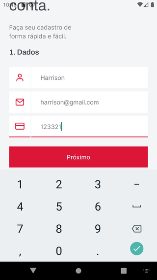

# Rentx app

## About this Project

_"The objective of this project is to exercise some React Native concepts as part of the [Ignite program](https://rocketseat.com.br/ignite)"._

## Why?

This project is part of my personal portfolio, so, I'll be happy if you could provide me any feedback about the project, code, structure or anything that you can report that could make me a better developer!

Email-me: harrisonhenrisn@gmail.com

Connect with me at [LinkedIn](https://linkedin.com/in/harrison-henri-dos-santos-nascimento).

Also, you can use this Project as you wish, be for study, be for make improvements or earn money with it!

It's free!

## Functionalities

- Splash screen


- Create account screen



- Home screen


- Profile screen


- Details screen


- Schedule screen


- Rental details screen


- Confirmation screen


- User rentals screen


## Install

Clone the repo using

```
$ git clone https://github.com/HarrisonHenri/rentx
```

```
$ cd rentx
```

Install all the required dependencies

```
$ yarn
```

Runs the [api](https://github.com/HarrisonHenri/rentxapi)

Then execute

```
$ yarn start
```

## Some concepts applied

- Refresh token
- Image caching
- Offline first

## Built With

- [React](https://github.com/facebook/react) - Build the web app using JavaScript and React
- [React-navigation](https://github.com/react-navigation/react-navigation) - Routing and navigation for your React Native apps
- [React-native](https://github.com/expo/react-native) - Build the native app using JavaScript and React
- [Axios](https://github.com/axios/axios) - HTTP Client
- [Vector Icon](https://github.com/expo/vector-icons)
- [Watermelondb](https://github.com/Nozbe/WatermelonDB) - Local database
- [Net Info](https://github.com/react-native-netinfo/react-native-netinfo) - Net info utils
- [Expo](https://github.com/expo/expo)
- [Expo image-picker](https://github.com/expo/expo/tree/master/packages/expo-image-picker)
- [Lottie](https://github.com/lottie-react-native/lottie-react-native)
- [Yup](https://github.com/jquense/yup) - Schema builder for value parsing and validation

## Contributing

You can send how many PR's do you want, I'll be glad to analyse and accept them! And if you have any question about the project...

Email-me: harrisonhenrisn@gmail.com

Connect with me at [LinkedIn](https://linkedin.com/in/harrison-henri-dos-santos-nascimento-a6ba33112).

Thank you!
